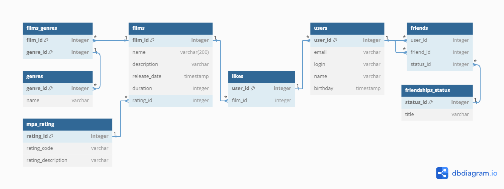

# java-filmorate
Template repository for Filmorate project.

# Схема базы данных
***

***

## Описание схемы базы данных
***
### ***Схема базы данных состоит их следующих таблиц***
* `users`- Информация о пользователях.
* `films`- Информация о фильмах.
* `genres`- Информация о жанрах фильмов.
* `films_genres`- Связи между фильмами и их жанрами.
* `mpa_rating`- Информация о рейтинге Ассоциации кинокомпаний.
* `likes`- Лайки пользователей к фильмам.
* `friends`- Информация о друзьях.
* `friendships_status`- Информация о дружбе между пользователями.
***

# Примеры запросов
***
### Получение всех фильмов:
```
SELECT *
FROM Films;
```

### Получение всех пользователей:
```
SELECT * 
FROM Users;
```